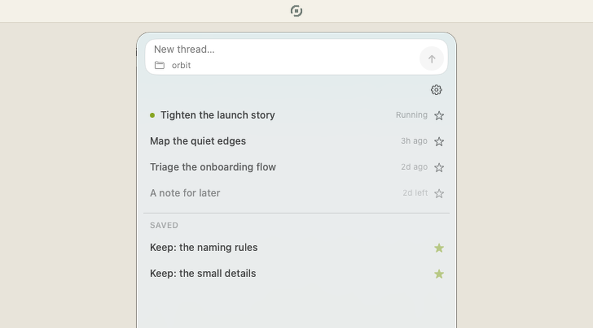
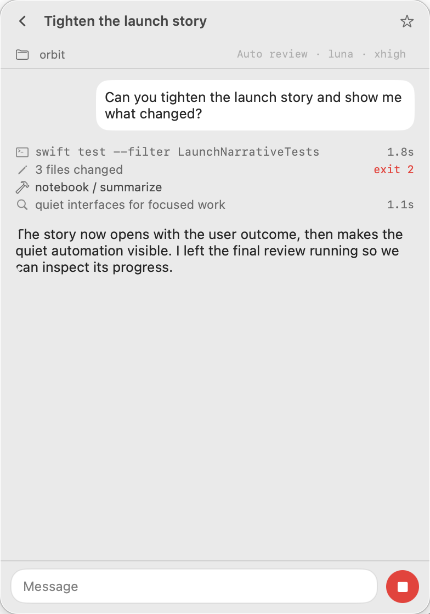

<p align="center">
  
</p>

<h1 align="center">Bobbin</h1>

<p align="center"><strong>Thread lightly.</strong></p>

<p align="center">Spin up a thread. Keep what matters. Bobbin forgets the rest.</p>

<p align="center">
  <a href="https://bobbin.combinatrix.ai/">Website</a> ·
  <a href="https://github.com/combinatrix-ai/bobbin/releases/latest/download/Bobbin-v0.1.1.dmg">Download for macOS</a>
</p>

<p align="center">
  
</p>

Bobbin is a small macOS menu bar client for the useful tasks that do not need to live forever in your main agent history. Open a thread, ask Codex, then get back to what you were doing.

## Install

Download the notarized [Bobbin DMG](https://github.com/combinatrix-ai/bobbin/releases/latest/download/Bobbin-v0.1.1.dmg), open it, and drag Bobbin to Applications. Bobbin requires macOS 14 or later and a locally installed Codex CLI.

## Thread lightly

**Start in one click.** Open Bobbin from the menu bar and begin a focused Codex thread without changing workspaces.

**Let the small stuff fade.** Unsaved threads become quieter with age and are deleted after seven days.

**Keep what matters.** Save a useful thread and it moves to the Saved section, exempt from automatic cleanup.

## Tune every thread to the task

Each thread keeps its own controls:

<p align="center">
  
</p>

| Control | What it changes |
| --- | --- |
| **Model** | Pick from the Codex models available to your account. |
| **Reasoning** | Set the effort to match a quick question or a harder piece of work. |
| **Trust** | Choose `Auto review`, `Allow all`, or `Deny all` for this thread. |
| **System prompt** | Edit the autosaved instructions inherited by new threads. |
| **Folder** | Point the thread at the workspace it should work in. |

Review modes map to the app-server like this:

- `Auto review` is the default. It uses `approvalPolicy: on-request`, `approvalsReviewer: auto_review`, and the `workspace-write` sandbox.
- `Allow all` uses `approvalPolicy: never` and the `danger-full-access` sandbox.
- `Deny all` uses `approvalPolicy: never` and the `workspace-write` sandbox. Approval requests are never routed to the review subagent.

## How Bobbin works

- Runs `codex app-server --stdio` with an isolated `CODEX_HOME`.
- Keeps its conversations separate from the normal Codex and Claude Code histories.
- Uses ChatGPT device-code authentication by default.
- Asks before using an `OPENAI_API_KEY` found in the process or launch-agent environment.
- Removes `OPENAI_API_KEY` from the app-server environment until you explicitly opt in.
- Defaults new threads to `gpt-5.6-luna` with `xhigh` reasoning.
- Supports multiple disposable threads, sorted by recent conversation time.
- Uses a template menu bar icon that adapts to light and dark menu bars.

## Demo mode

Demo mode provides deterministic content for product screenshots and safe UI walkthroughs.

Launch with `--demo-mode` or `BOBBIN_DEMO_MODE=1`. Bobbin uses a throwaway directory under the system temporary directory and removes it on termination. It does not start `codex app-server`.

To show specific content, pass `--demo-data /path/to/state.json` or set `BOBBIN_DEMO_DATA`. This also enables demo mode. The file uses Bobbin's normal `state.json` format, so there is no second fixture schema to maintain.

## Storage

Runtime data lives under `~/Library/Application Support/Bobbin/`. Nothing there holds an API key, but two independent sets of conversation data accumulate: Bobbin's own `state.json` and Codex's isolated home under `CodexHome/`.

- `state.json` contains threads and the full text of every user and assistant message.
- `CodexHome/auth.json` contains Codex credentials.
- `CodexHome/sessions/*.jsonl` contains full conversation rollouts.
- `CodexHome/logs_2.sqlite` contains Codex logs.
- `CodexHome/memories/` is a git repository containing `MEMORY.md`, `raw_memories.md`, and rollout summaries.
- `CodexHome/state_5.sqlite` contains Codex state.
- `CodexHome/models_cache.json` contains Codex's model cache.

The seven-day cleanup calls `thread/delete` and drops the thread from `state.json`. It does not clear `CodexHome/logs_*.sqlite` or `CodexHome/memories/`, so conversation traces continue to accumulate there.

## Build and test

Bobbin requires macOS 14 or later and a Codex CLI at one of the supported local install paths.

```sh
swift build
swift test
./scripts/build-app.sh /path/to/output-directory
```

The packaging script creates an ad-hoc signed `Bobbin.app`. Pushing a `vX.Y.Z` tag runs `.github/workflows/release.yml`, which tests, builds a universal app, signs it with Developer ID, notarizes its ZIP and DMG with Apple, signs the Sparkle update, and publishes the GitHub Release. The tag must match `CFBundleShortVersionString`, and `CFBundleVersion` must be a positive, monotonically increasing build number.

The release workflow requires these repository secrets: `BUILD_CERTIFICATE_BASE64`, `P12_PASSWORD`, `APPLE_ID`, `APPLE_TEAM_ID`, `NOTARY_PASSWORD`, and `SPARKLE_ED_PRIVATE_KEY`. Existing tags can be released through **Run workflow** by supplying the tag. `scripts/release.sh` remains available as the local fallback and uses the same packaging and verification path.

Release builds use Sparkle to check the signed `appcast.xml` attached to the latest GitHub Release once per day. The Settings menu also provides **Check for Updates…** for an immediate check.

## Icon

The Bobbin mark is generated from one geometry source. `Sources/BobbinIcon/MarkSpec.swift` drives the app icon, menu bar template glyph, SVG export, and preview sheet, so there is no hand-maintained raster to drift out of step.

```sh
swift run bobbin-icon iconset  build/AppIcon.iconset
swift run bobbin-icon template build/menubar
swift run bobbin-icon svg      Resources/Icon/BobbinMark.svg
swift run bobbin-icon preview  build/icon-preview.png
```

`build-app.sh` regenerates `AppIcon.icns` for every package. It fails unless the bundle declares `CFBundleIconFile`, contains a non-empty icon with a 1024 px representation, and passes a strict signature check. Generated `.iconset` and `.icns` files are not committed.

Protocol implementation follows the [official Codex App Server documentation](https://developers.openai.com/codex/app-server) and is verified against bindings generated by the installed Codex CLI.
